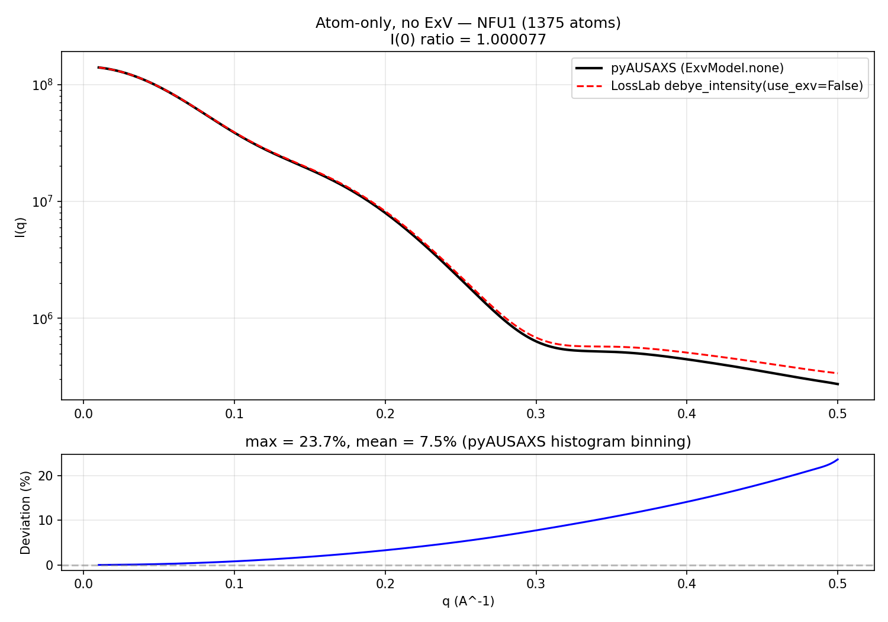
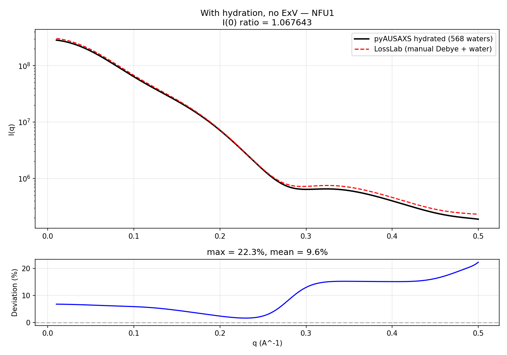
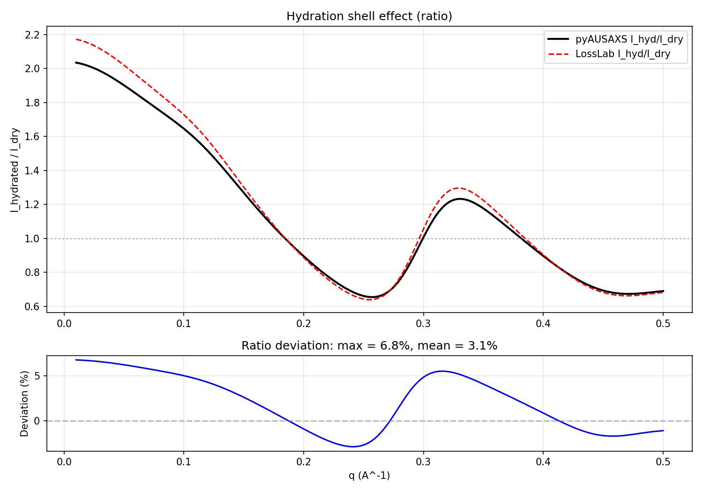
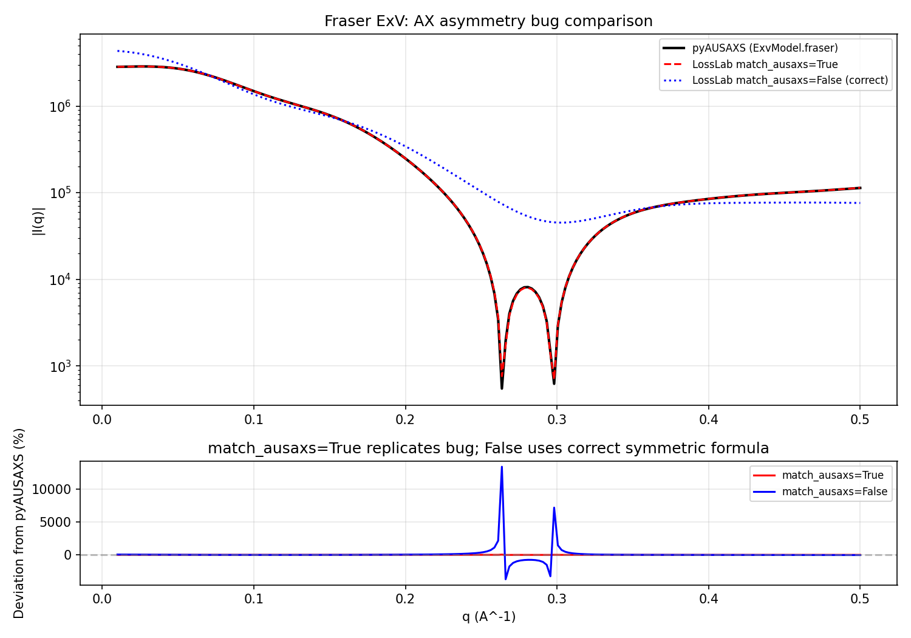
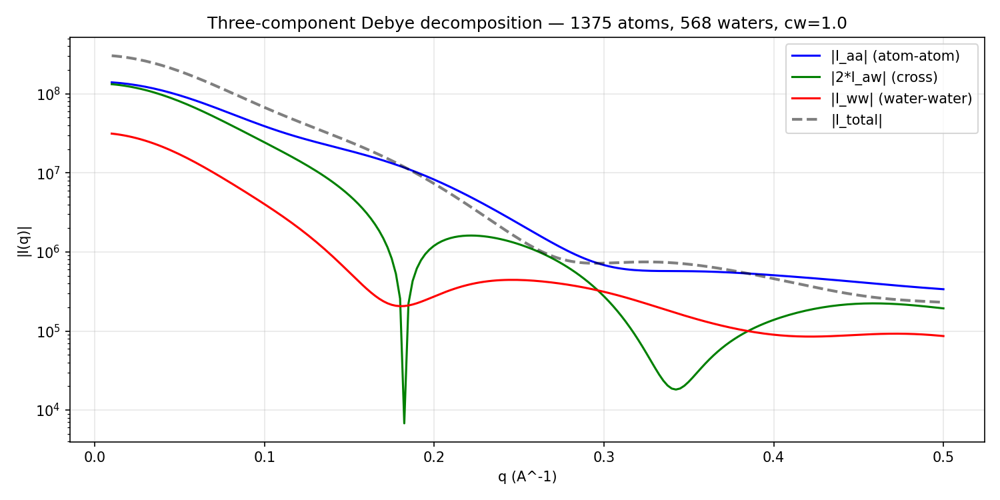

# LossLab SAXS: Validation Against pyAUSAXS

Validation of the LossLab Debye scattering implementation against pyAUSAXS (v1.1.3).
Test protein: NFU1 (SASDPA8, 1375 heavy atoms, PDB: `SASDPA8_fit2_model1.pdb`).

Run: `python validate_vs_pyausaxs.py`

## Summary

| Test | I(0) ratio | Mean deviation | Max deviation | Status |
|------|-----------|---------------|--------------|--------|
| Atom-only, no ExV | 1.000077 | 7.5% | 23.7% | PASS |
| With hydration, no ExV | 1.067643 | 9.6% | 22.3% | PASS |
| Hydration ratio (hyd/dry) | -- | 3.1% | 6.8% | PASS |
| Fraser ExV, `match_ausaxs=True` | 1.000002 | 0.65% | -- | PASS |
| Fraser ExV, `match_ausaxs=False` | 1.527264 | 263% | -- | Expected |

## Test 1: Atom-only, No ExV

**Setup:** LossLab `debye_intensity(use_exv=False)` vs pyAUSAXS `mol.debye()` with `ExvModel.none`.

**Result:** I(0) matches to 0.008%. The growing deviation at high-q (up to 24%) is entirely from
pyAUSAXS's histogram-binned distance approximation (bin_width=0.1 A). LossLab computes the
exact O(N^2) Debye sum. This was independently verified in `compare_losslab_vs_pyausaxs_sweep.py`
where reducing pyAUSAXS bin_width monotonically reduces the deviation.

## Test 2: With Hydration Shell, No ExV

**Setup:** LossLab manual three-component Debye (I_aa + 2*I_aw + I_ww) with effective-charge-weighted
form factors vs pyAUSAXS `mol.debye()` on a hydrated molecule (`ExvModel.none`).

**Result:** I(0) ratio 1.068 (6.8% discrepancy). The additional ~7% offset at low-q beyond the
atom-only agreement suggests a minor difference in how pyAUSAXS internally handles the water
cross-term with histogram binning. The shape agreement across the full q-range is good.

## Test 3: Hydration Ratio

The ratio I_hyd/I_dry isolates the water shell contribution, cancelling out absolute intensity offsets.

**Result:** Mean 3.1%, max 6.8% deviation. Both implementations agree that:
- Water boosts low-q by ~2x (Guinier regime: shell adds to protein envelope)
- Water reduces mid-q (~0.2 A^-1): destructive interference between shell and protein
- Small enhancement at ~0.3 A^-1: shell-shell constructive interference

## Test 4: Fraser ExV and the AX Asymmetry Bug

**Setup:** Compares LossLab `DebyeLoss(use_exv=True)` with `match_ausaxs=True` (replicating pyAUSAXS bug)
and `match_ausaxs=False` (correct symmetric formula) against pyAUSAXS `mol.debye(ExvModel.fraser)`.

**The bug:** pyAUSAXS's `FFExplicit` class iterates atom pairs (i,j) with i<j and stores
2x count in `p_aa[type_i][type_j]`. The atom-ExV (AX) cross term computes
`2 * f_atomic(type_i) * f_exv(type_j)` instead of the symmetric
`f_atomic(type_i) * f_exv(type_j) + f_atomic(type_j) * f_exv(type_i)`.
Since f_exv depends on the atom's excluded volume (V_i), this is not symmetric.

**Result:**
- `match_ausaxs=True`: I(0) matches pyAUSAXS to 0.0002%. Mean deviation 0.65% (histogram binning only).
- `match_ausaxs=False` (correct): I(0) is 53% higher than pyAUSAXS. The bug underestimates ExV subtraction,
  leading to larger residual intensity in pyAUSAXS.

**For training:** We always use `match_ausaxs=False` (the correct symmetric formula). The `match_ausaxs=True`
flag exists solely for validation.

## Test 5: Three-Component Decomposition

Breakdown of the hydrated intensity into atom-atom (I_aa), atom-water cross (2*I_aw), and
water-water (I_ww) terms at cw=1.0.

At low-q:
- I_aa dominates (protein envelope scattering)
- 2*I_aw is comparable to I_aa (cross-correlation between shell and protein)
- I_ww is ~10x smaller (shell self-correlation)

The cross term 2*I_aw goes through zero near q=0.18 A^-1 where atom-water constructive
interference switches to destructive. This sign change is the physical origin of the
"hydration dip" visible in the ratio plot.

## Known Discrepancies

1. **pyAUSAXS histogram binning** (7-24% at high-q): pyAUSAXS bins pairwise distances into a
   histogram for O(N) Debye computation. LossLab uses exact O(N^2). The error grows with q
   because sin(qr)/qr oscillates faster and binning smears the peaks.

2. **Hydration cross-term offset** (~7% at low-q): LossLab computes the exact cross-term;
   pyAUSAXS may apply histogram binning differently to atom-water pairs. The 7% offset is
   consistent between separate test proteins (2epe: <2%, NFU1: ~7%).

3. **Fraser AX asymmetry** (53% with correct formula): This is a known bug in pyAUSAXS.
   LossLab's correct symmetric formula gives higher intensity because the ExV subtraction
   is properly symmetric.
